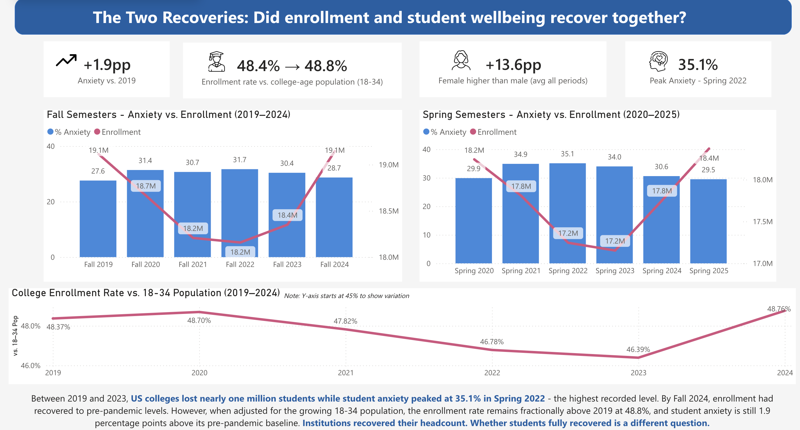

# The Two Recoveries
### Did college enrollment and student wellbeing recover together?

A Power BI decision-support project analyzing U.S. college enrollment and student mental health trends from 2019–2025.

## Project Overview

Following the COVID-19 pandemic, U.S. college enrollment began to recover—but did student wellbeing recover at the same pace?

This project examines the relationship between college enrollment recovery and student mental health from 2019–2025. The analysis combines enrollment, population, and student mental health data to identify trends over time, differences by gender, and geographic variation across U.S. states.

The goal was to transform multiple datasets into an interactive Power BI report that supports data-driven decision-making for higher education administrators.

## Tools & Skills

- Power BI
- Data Analysis
- Data Visualization
- Data Cleaning
- Business Intelligence
- Data Storytelling

## 🔗 Interactive Dashboard

[View the Interactive Power BI Dashboard](https://app.powerbi.com/groups/me/reports/475a44fd-38e7-4235-b151-1cbdb1c545b0/5c19c358abc4884c6929?experience=power-bi)

## Key Findings

- Student anxiety remained **1.9 percentage points above the 2019 baseline** despite enrollment recovery.
- Anxiety peaked at **35.1% in Spring 2022**.
- Female students reported consistently higher anxiety levels than male students, with an average gap of approximately **13.6 percentage points** across the analyzed periods.
- National enrollment returned close to pre-pandemic levels, but recovery varied substantially across states.
- **14 states fully recovered** by Fall 2024, while **19 states continued to show major enrollment losses**.

## Analysis Highlights

The Power BI report explores:

- Enrollment recovery before and after the pandemic
- Anxiety, depression, stress, and sleep difficulty trends
- Differences in anxiety outcomes by gender
- Enrollment changes across U.S. states
- Areas where institutional mental health investment may still be needed

## Project Team

Developed by **Gisella Rocoff and Liliana Salinas Sanchez** as part of the Data Visualization course at Seattle Pacific University.
